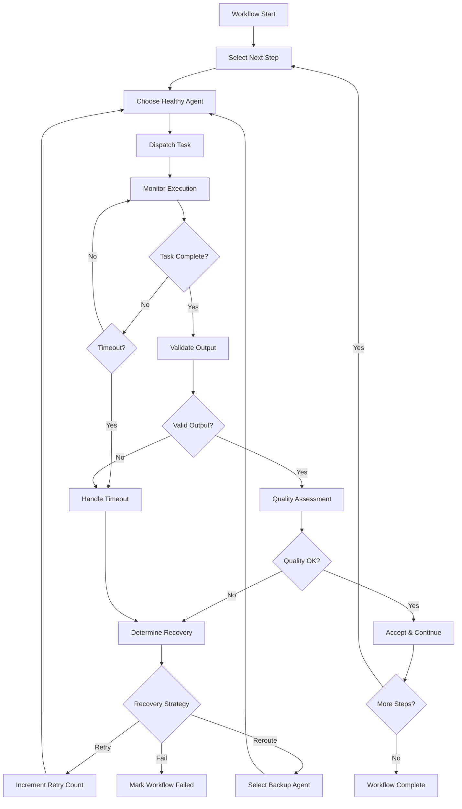
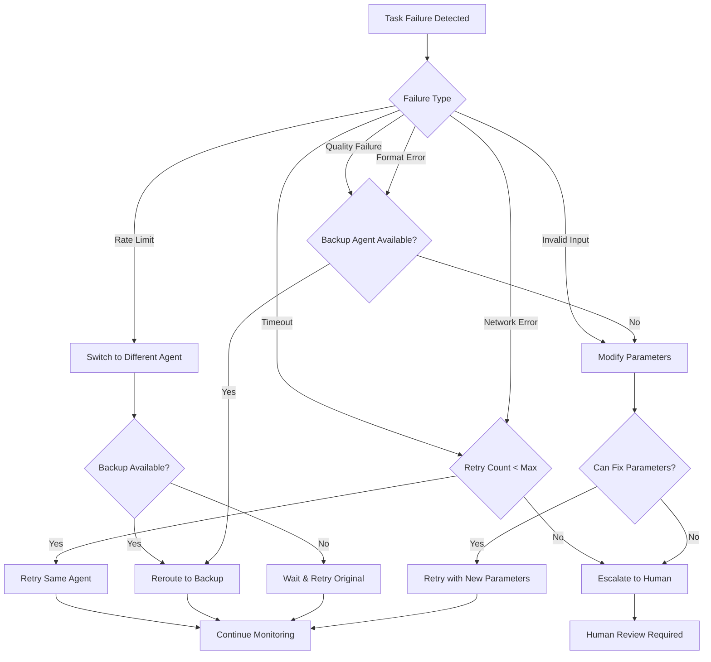

# Phase 0 - Meta-Agent Supervision Strategy

## Meta-Agent Core Responsibilities

### Primary Functions
1. **Workflow Orchestration**: Route tasks to appropriate agents based on capabilities
2. **Quality Validation**: Verify outputs meet schema and quality requirements
3. **Error Detection**: Monitor for timeouts, failures, and invalid responses
4. **Recovery Management**: Retry failed tasks, reroute to alternative agents
5. **Resource Monitoring**: Track agent health, load balancing, performance metrics

### Meta-Agent Architecture
```
┌─────────────────────────────────────────────────────────────────┐
│                    Global Meta-Agent                            │
│  ┌───────────────┐  ┌───────────────┐  ┌───────────────────┐   │
│  │   Workflow    │  │   Quality     │  │    Resource       │   │
│  │  Orchestrator │  │  Validator    │  │    Monitor        │   │
│  └───────────────┘  └───────────────┘  └───────────────────┘   │
└─────────────────────────────────────────────────────────────────┘
                               │
                    ┌──────────┼──────────┐
                    │          │          │
           ┌────────────┐ ┌────────────┐ ┌────────────┐
           │   Neural   │ │  Symbolic  │ │ External   │
           │   Agent    │ │   Agent    │ │   Agent    │
           │ (local     │ │ (local     │ │ (local     │
           │  checks)   │ │  checks)   │ │  checks)   │
           └────────────┘ └────────────┘ └────────────┘
```

## Hierarchical Supervision Model

### Level 1: Local Agent Self-Monitoring
**Responsibility**: Each agent performs basic self-checks before reporting results

```python
class AgentSelfMonitor:
    def __init__(self, agent_id: str):
        self.agent_id = agent_id
        self.expected_output_schema = self.load_output_schema()
    
    def pre_execution_check(self, task: Task) -> bool:
        """Validate task before processing"""
        # Check if input format matches agent capabilities
        if not self.can_handle_input_format(task.input_format):
            raise InvalidInputError(f"Cannot handle format: {task.input_format}")
        
        # Check if required parameters are present
        if not self.validate_parameters(task.parameters):
            raise MissingParametersError("Required parameters missing")
        
        # Check resource availability
        if not self.check_resource_availability():
            raise ResourceUnavailableError("Insufficient resources")
        
        return True
    
    def post_execution_check(self, output: Any, task: Task) -> ValidationResult:
        """Validate output before sending to meta-agent"""
        validation_result = ValidationResult()
        
        # Schema validation
        if not self.validate_output_schema(output):
            validation_result.add_error("Schema validation failed")
        
        # Content validation (agent-specific)
        content_validation = self.validate_content_quality(output, task)
        validation_result.merge(content_validation)
        
        # Size and format checks
        if not self.validate_output_size(output):
            validation_result.add_warning("Output size exceeds recommendations")
        
        return validation_result
```

### Level 2: Global Meta-Agent Supervision
**Responsibility**: Orchestrate workflow, validate cross-agent consistency, handle failures

```python
class GlobalMetaAgent:
    def __init__(self):
        self.agent_registry = AgentRegistry()
        self.workflow_engine = WorkflowEngine()
        self.quality_validator = QualityValidator()
        self.recovery_manager = RecoveryManager()
    
    def execute_workflow(self, workflow: Workflow) -> WorkflowResult:
        """Main workflow execution with supervision"""
        workflow_state = WorkflowState(workflow)
        
        try:
            for step in workflow.steps:
                self.execute_step_with_supervision(step, workflow_state)
            
            return WorkflowResult(
                status='completed',
                artifacts=workflow_state.generated_artifacts,
                metrics=workflow_state.execution_metrics
            )
        
        except WorkflowFailedException as e:
            return self.handle_workflow_failure(e, workflow_state)
    
    def execute_step_with_supervision(self, step: WorkflowStep, state: WorkflowState):
        """Execute single workflow step with full supervision"""
        
        # 1. Agent Selection and Health Check
        agent = self.select_healthy_agent(step.required_capabilities)
        if not agent:
            raise NoAvailableAgentError(f"No healthy agent for: {step.required_capabilities}")
        
        # 2. Task Dispatch with Monitoring
        task_result = self.dispatch_task_with_monitoring(agent, step, state)
        
        # 3. Output Validation
        validation_result = self.validate_task_output(task_result, step)
        
        # 4. Quality Assessment
        quality_score = self.assess_output_quality(task_result, step, state)
        
        # 5. Decision: Accept, Retry, or Escalate
        if validation_result.is_valid() and quality_score >= step.min_quality_threshold:
            self.accept_task_result(task_result, state)
        else:
            self.handle_unsatisfactory_result(task_result, validation_result, quality_score, step, state)
```

## Monitoring Logic Implementation

### Output Validity Checking
```python
class QualityValidator:
    def __init__(self):
        self.schema_validators = self.load_schema_validators()
        self.content_validators = self.load_content_validators()
    
    def validate_task_output(self, task_result: TaskResult, step: WorkflowStep) -> ValidationResult:
        """Comprehensive output validation"""
        validation = ValidationResult()
        
        # 1. Schema Validation
        schema_result = self.validate_schema(task_result.output, step.expected_output_schema)
        validation.merge(schema_result)
        
        # 2. Content Type Validation
        content_type_result = self.validate_content_type(task_result.output, step.expected_content_type)
        validation.merge(content_type_result)
        
        # 3. Business Logic Validation
        business_result = self.validate_business_rules(task_result.output, step.business_rules)
        validation.merge(business_result)
        
        # 4. Cross-Reference Validation (if applicable)
        if step.requires_cross_validation:
            cross_ref_result = self.validate_against_previous_outputs(task_result.output, step, state)
            validation.merge(cross_ref_result)
        
        return validation
    
    def validate_schema(self, output: Any, schema: Dict) -> ValidationResult:
        """JSON Schema validation for structured outputs"""
        try:
            jsonschema.validate(output, schema)
            return ValidationResult.success("Schema validation passed")
        except jsonschema.ValidationError as e:
            return ValidationResult.error(f"Schema validation failed: {e.message}")
    
    def assess_content_quality(self, output: Any, context: Dict) -> float:
        """AI-based content quality assessment"""
        quality_metrics = {
            'completeness': self.check_completeness(output, context),
            'coherence': self.check_coherence(output),
            'relevance': self.check_relevance(output, context),
            'accuracy': self.check_accuracy(output, context)
        }
        
        # Weighted average based on task type
        weights = context.get('quality_weights', {
            'completeness': 0.3,
            'coherence': 0.3,
            'relevance': 0.2,
            'accuracy': 0.2
        })
        
        return sum(score * weights.get(metric, 0.25) for metric, score in quality_metrics.items())
```

### Failure Detection and Classification
```python
class FailureDetector:
    def __init__(self):
        self.timeout_thresholds = self.load_timeout_config()
        self.failure_patterns = self.load_failure_patterns()
    
    def detect_failure_type(self, task_result: TaskResult, agent: Agent, step: WorkflowStep) -> FailureType:
        """Classify failure type for appropriate recovery strategy"""
        
        # Timeout Detection
        if task_result.execution_time > self.timeout_thresholds[agent.type]:
            return FailureType.TIMEOUT
        
        # Agent Error Detection
        if task_result.status == 'error':
            if 'rate_limit' in task_result.error_message.lower():
                return FailureType.RATE_LIMIT
            elif 'network' in task_result.error_message.lower():
                return FailureType.NETWORK_ERROR
            elif 'invalid_input' in task_result.error_message.lower():
                return FailureType.INVALID_INPUT
            else:
                return FailureType.AGENT_ERROR
        
        # Quality Failure Detection
        if hasattr(task_result, 'quality_score') and task_result.quality_score < step.min_quality_threshold:
            return FailureType.QUALITY_FAILURE
        
        # Output Format Failure
        if not self.validate_output_format(task_result.output, step.expected_format):
            return FailureType.FORMAT_ERROR
        
        return FailureType.UNKNOWN

class FailureType(Enum):
    TIMEOUT = "timeout"
    RATE_LIMIT = "rate_limit"
    NETWORK_ERROR = "network_error"
    INVALID_INPUT = "invalid_input"
    AGENT_ERROR = "agent_error"
    QUALITY_FAILURE = "quality_failure"
    FORMAT_ERROR = "format_error"
    UNKNOWN = "unknown"
```

### Recovery and Rerouting Strategy
```python
class RecoveryManager:
    def __init__(self):
        self.retry_strategies = self.load_retry_strategies()
        self.rerouting_rules = self.load_rerouting_rules()
    
    def handle_task_failure(self, failure: TaskFailure, step: WorkflowStep, state: WorkflowState) -> RecoveryAction:
        """Determine and execute recovery strategy"""
        
        failure_type = failure.failure_type
        retry_count = failure.retry_count
        
        # Determine recovery strategy based on failure type and context
        recovery_strategy = self.select_recovery_strategy(failure_type, retry_count, step)
        
        match recovery_strategy:
            case RecoveryStrategy.RETRY_SAME_AGENT:
                return self.retry_with_same_agent(failure, step, state)
            
            case RecoveryStrategy.REROUTE_TO_BACKUP:
                return self.reroute_to_backup_agent(failure, step, state)
            
            case RecoveryStrategy.MODIFY_PARAMETERS:
                return self.retry_with_modified_parameters(failure, step, state)
            
            case RecoveryStrategy.ESCALATE_TO_HUMAN:
                return self.escalate_to_human_review(failure, step, state)
            
            case RecoveryStrategy.FAIL_WORKFLOW:
                return self.fail_workflow_gracefully(failure, step, state)
    
    def select_recovery_strategy(self, failure_type: FailureType, retry_count: int, step: WorkflowStep) -> RecoveryStrategy:
        """Rule-based recovery strategy selection"""
        
        max_retries = step.max_retries or 3
        
        if retry_count >= max_retries:
            return RecoveryStrategy.FAIL_WORKFLOW
        
        strategy_map = {
            FailureType.TIMEOUT: [RecoveryStrategy.RETRY_SAME_AGENT, RecoveryStrategy.REROUTE_TO_BACKUP],
            FailureType.RATE_LIMIT: [RecoveryStrategy.REROUTE_TO_BACKUP, RecoveryStrategy.RETRY_SAME_AGENT],
            FailureType.NETWORK_ERROR: [RecoveryStrategy.RETRY_SAME_AGENT, RecoveryStrategy.REROUTE_TO_BACKUP],
            FailureType.INVALID_INPUT: [RecoveryStrategy.MODIFY_PARAMETERS, RecoveryStrategy.ESCALATE_TO_HUMAN],
            FailureType.QUALITY_FAILURE: [RecoveryStrategy.REROUTE_TO_BACKUP, RecoveryStrategy.MODIFY_PARAMETERS],
            FailureType.FORMAT_ERROR: [RecoveryStrategy.REROUTE_TO_BACKUP, RecoveryStrategy.MODIFY_PARAMETERS]
        }
        
        strategies = strategy_map.get(failure_type, [RecoveryStrategy.RETRY_SAME_AGENT])
        return strategies[min(retry_count, len(strategies) - 1)]
```

## Agent Health Monitoring

### Health Check Implementation
```python
class AgentHealthMonitor:
    def __init__(self):
        self.health_metrics = {}
        self.alert_thresholds = self.load_alert_thresholds()
    
    def monitor_agent_health(self, agent: Agent) -> HealthStatus:
        """Continuous health monitoring for agents"""
        
        metrics = self.collect_agent_metrics(agent)
        health_score = self.calculate_health_score(metrics)
        status = self.determine_health_status(health_score, metrics)
        
        # Update health history
        self.update_health_history(agent.id, status, metrics)
        
        # Trigger alerts if necessary
        if status.level >= HealthLevel.DEGRADED:
            self.trigger_health_alert(agent, status, metrics)
        
        return status
    
    def collect_agent_metrics(self, agent: Agent) -> AgentMetrics:
        """Collect comprehensive agent metrics"""
        return AgentMetrics(
            response_time=self.measure_response_time(agent),
            success_rate=self.calculate_success_rate(agent),
            error_rate=self.calculate_error_rate(agent),
            resource_usage=self.get_resource_usage(agent),
            queue_length=self.get_queue_length(agent),
            last_successful_task=self.get_last_successful_task_time(agent)
        )
    
    def calculate_health_score(self, metrics: AgentMetrics) -> float:
        """Calculate composite health score (0.0 - 1.0)"""
        weights = {
            'success_rate': 0.4,
            'response_time': 0.2,
            'error_rate': 0.2,
            'resource_usage': 0.1,
            'availability': 0.1
        }
        
        normalized_metrics = {
            'success_rate': metrics.success_rate,
            'response_time': max(0, 1 - (metrics.response_time / 120)),  # 120s max acceptable
            'error_rate': max(0, 1 - metrics.error_rate),
            'resource_usage': max(0, 1 - (metrics.resource_usage / 0.9)),  # 90% max acceptable
            'availability': 1.0 if metrics.last_successful_task < 300 else 0.0  # 5 min threshold
        }
        
        return sum(score * weights[metric] for metric, score in normalized_metrics.items())
```

## Supervision Workflow Diagrams

### Main Supervision Flow


### Error Recovery Decision Tree


## Phase 0 Implementation Priorities (Simplified)

### Week 1-2: Core Meta-Agent (Health-Aware Router)
```python
class SimpleMetaAgent:
    """Minimal meta-agent for Phase 0: health-aware router with basic retry/reroute"""
    
    def __init__(self):
        self.agent_registry = {}
        self.agent_health = {}  # Simple: 'healthy' | 'degraded' | 'offline'
    
    def execute_workflow(self, steps: List[WorkflowStep]) -> WorkflowResult:
        results = []
        
        for step in steps:
            result = self.execute_step_with_basic_supervision(step)
            results.append(result)
        
        return WorkflowResult(status='completed', results=results)
    
    def execute_step_with_basic_supervision(self, step: WorkflowStep) -> TaskResult:
        """Simple supervision: route → validate → retry → reroute → fail"""
        
        # 1. Health-aware agent selection
        primary_agent = self.select_healthy_agent(step.required_capabilities)
        
        # 2. First attempt
        result = self.dispatch_task_with_timeout(primary_agent, step)
        
        # 3. Basic validation
        if self.is_valid_result(result, step):
            return result
        
        # 4. Retry logic: retry once → reroute → fail
        if result.status in ['timeout', 'error']:
            # Retry once with same agent
            retry_result = self.dispatch_task_with_timeout(primary_agent, step)
            if self.is_valid_result(retry_result, step):
                return retry_result
            
            # Reroute to backup agent
            backup_agent = self.select_backup_agent(step.required_capabilities, exclude=primary_agent.id)
            if backup_agent:
                backup_result = self.dispatch_task_with_timeout(backup_agent, step)
                if self.is_valid_result(backup_result, step):
                    return backup_result
        
        # Mark as failed
        return TaskResult(status='failed', error=f"All attempts failed for step: {step.name}")
    
    def select_healthy_agent(self, capabilities: List[str]) -> Agent:
        """Simple health check: ping agent, return if responsive"""
        candidate_agents = self.get_agents_by_capabilities(capabilities)
        
        for agent in candidate_agents:
            if self.simple_health_check(agent):
                return agent
        
        raise NoHealthyAgentError(f"No healthy agents found for capabilities: {capabilities}")
    
    def simple_health_check(self, agent: Agent) -> bool:
        """Basic health check: HTTP ping with 5-second timeout"""
        try:
            response = requests.get(f"{agent.endpoint}/health", timeout=5)
            return response.status_code == 200
        except:
            return False
    
    def is_valid_result(self, result: TaskResult, step: WorkflowStep) -> bool:
        """Basic validation: schema + size sanity check"""
        if result.status != 'completed':
            return False
        
        # Schema validation (basic JSON structure check)
        if not self.validate_basic_schema(result.output, step.expected_output_type):
            return False
        
        # Size sanity check
        if not self.validate_output_size(result.output):
            return False
        
        return True
    
    def validate_basic_schema(self, output: Any, expected_type: str) -> bool:
        """Simple type checking"""
        if expected_type == 'text/plain':
            return isinstance(output, str) and len(output.strip()) > 0
        elif expected_type == 'application/json':
            return isinstance(output, (dict, list))
        return True  # Accept other types for now
    
    def validate_output_size(self, output: Any) -> bool:
        """Sanity check: output not too large or too small"""
        output_size = len(str(output))
        return 10 < output_size < 1_000_000  # 10 chars to 1MB
```

### Week 3-4: Foundation for Advanced Features (Scaffolded)
```python
# Scaffold for future expansion - interfaces only, minimal implementation

class AdvancedQualityValidator:
    """Placeholder for future quality assessment"""
    def assess_quality(self, output: Any, context: Dict) -> float:
        return 0.8  # Dummy score for now

class ParameterTuner:
    """Placeholder for future parameter optimization"""
    def suggest_parameters(self, failed_result: TaskResult) -> Dict:
        return {}  # No modifications for now

class HumanEscalation:
    """Placeholder for future human-in-the-loop"""
    def escalate(self, failure: TaskFailure) -> EscalationTicket:
        print(f"Would escalate: {failure}")  # Log only for now
        return None
```

### Phase 0 Success Criteria (Simplified)
- ✅ **Health-aware routing**: Meta-agent selects working agents via health check
- ✅ **Basic validation**: Schema (type) + size sanity checks work
- ✅ **Retry + reroute**: Retry once → reroute to backup → mark failed
- ✅ **Workflow completion**: End-to-end workflow executes with supervision

## Configuration for Phase 0

### Supervision Configuration
```yaml
meta_agent:
  max_concurrent_workflows: 5
  default_timeout: 60  # seconds
  max_retries: 3
  health_check_interval: 30  # seconds

quality_thresholds:
  neural_agents:
    min_confidence: 0.7
    max_response_time: 60
  symbolic_agents:
    min_confidence: 0.9
    max_response_time: 30

recovery_strategies:
  timeout:
    - retry_same_agent
    - reroute_to_backup
  rate_limit:
    - reroute_to_backup
    - wait_and_retry
  quality_failure:
    - reroute_to_backup
    - modify_parameters
```

This supervision strategy provides robust workflow management while keeping Phase 0 implementation focused on core reliability features.